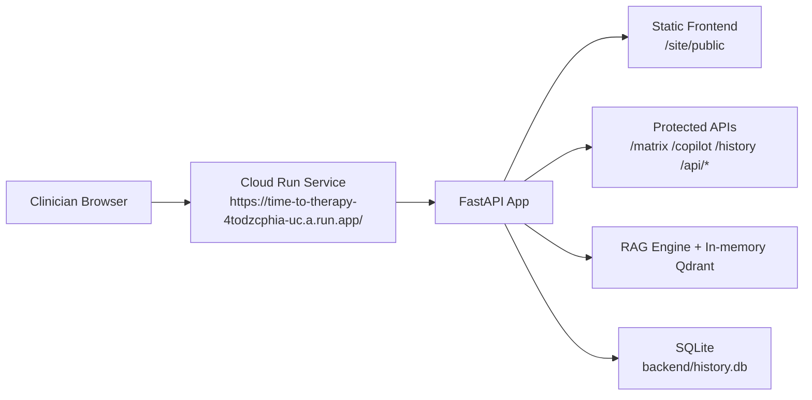

# Time-to-Therapy Prior Authorization Copilot
## Project Architecture (Current Implementation)

## 1. Purpose
Time-to-Therapy is a FastAPI + static web application for prior-authorization workflows.

It provides:
- payer policy comparison via a searchable matrix,
- AI-assisted PA draft generation grounded in indexed policy text,
- persisted draft history for review and auditability.

The current implementation is optimized for deterministic policy retrieval and demo-ready deployment, with local credential auth as default and optional Auth0 SSO.

## 2. System Overview

### Runtime topology
- Single FastAPI service in [backend/main.py](backend/main.py)
- Static frontend served by backend from [site/public](site/public)
- Policy source files served by backend from [backend/pipeline/documents](backend/pipeline/documents)
- In-memory Qdrant vector index built at process startup
- SQLite database for users and draft history at [backend/history.db](backend/history.db)

### Core technologies
- Backend: FastAPI, Starlette middleware, Pydantic
- Retrieval: Qdrant client (local in-memory collection)
- Draft generation: OpenAI-compatible client against NVIDIA NIM Nemotron endpoint
- Persistence: SQLite (single file)
- Frontend: HTML + Tailwind CDN + vanilla JS

## 3. Layered Architecture

### Frontend layer
Primary pages:
- [site/public/login.html](site/public/login.html)
- [site/public/matrix.html](site/public/matrix.html)
- [site/public/copilot.html](site/public/copilot.html)
- [site/public/history.html](site/public/history.html)

Shared client auth/bootstrap:
- [site/public/auth.js](site/public/auth.js)

Key frontend behaviors:
- same-origin API calls for session + protected endpoints,
- route guard bootstrap for authenticated pages,
- matrix filtering/comparison/category/export,
- draft export (PDF/CSV),
- history list/detail rendering from backend data.

### API/application layer
Entrypoint:
- [backend/main.py](backend/main.py)

Responsibilities:
- static and policy-file hosting,
- auth/session endpoints,
- page route protection and redirects,
- matrix/search/draft/history APIs,
- SQLite initialization + lightweight schema migration,
- integration of RAG retrieval and drafting.

### Retrieval layer
Core engine:
- [backend/pipeline/rag_engine.py](backend/pipeline/rag_engine.py)

Responsibilities:
- load TXT/PDF policy corpus,
- sanitize excluded content patterns,
- extract policy records from parsed sections,
- validate extracted records against schema,
- write invalid extractions to DLQ,
- build deterministic hashed embeddings,
- upsert chunks into in-memory Qdrant,
- serve semantic search + matrix rows + category lists.

Support utilities (not primary runtime path):
- [backend/pipeline/document_processor.py](backend/pipeline/document_processor.py)
- [backend/pipeline/ingestion.py](backend/pipeline/ingestion.py)

### Generation layer
PA drafting service:
- [backend/generator/drafter.py](backend/generator/drafter.py)

Responsibilities:
- compose a policy-grounded prompt,
- call Nemotron via NVIDIA-compatible OpenAI API,
- return strict-mode failures when configured,
- provide deterministic fallback letter when strict mode is off and LLM is unavailable.

### Data layer
- SQLite DB: [backend/history.db](backend/history.db)
- Policy schema: [backend/schema/policy.json](backend/schema/policy.json)
- Dead-letter queue: [backend/pipeline/dlq.jsonl](backend/pipeline/dlq.jsonl)
- Policy files: [backend/pipeline/documents](backend/pipeline/documents)

## 4. Authentication and Session Model

Auth behavior is environment-driven from [backend/auth.py](backend/auth.py):
- `AUTH_ENABLED=true` by default.
- Provider auto-selection:
  - `auth0` when all Auth0 settings are present,
  - `local` when Auth0 is not fully configured,
  - `none` only when auth is disabled.

### Local auth mode (default)
- `POST /auth/register` creates local users in `app_users`.
- `POST /auth/login` validates credentials.
- Password storage: PBKDF2-HMAC-SHA256 with per-user salt.
- Session cookie: signed token (`ttt_session`) using HMAC-SHA256.

### Auth0 mode (optional)
- Bearer JWT verification against Auth0 JWKS.
- Session establishment through `POST /auth/session`.
- Same session cookie mechanism used after backend session creation.

### Route protection
- Protected HTML routes redirect unauthenticated users to `/login`:
  - `/matrix`, `/copilot`, `/history`
- Static HTML under `/static/*.html` is also protected via middleware when auth is enabled.

## 5. Startup and Initialization
On process startup ([backend/main.py](backend/main.py)):
- environment variables are loaded once from `.env` via [backend/env_loader.py](backend/env_loader.py),
- fastembed/cache-related env vars are set before vector dependencies,
- static mounts are configured:
  - `/static` -> [site/public](site/public)
  - `/policies` -> [backend/pipeline/documents](backend/pipeline/documents)
- `RAGEngine` is initialized and indexes available policy docs,
- SQLite tables are ensured:
  - `pa_drafts` with migration to add `retrieved_rules` when missing,
  - `app_users` for local auth.

## 6. Primary Data Flows

### A. Matrix flow
1. UI calls `GET /api/matrix` with optional `query`, `payer`, `category`.
2. Backend delegates to `RAGEngine.build_matrix(...)`.
3. Engine returns rows derived from parsed policy records (not hardcoded payloads).
4. UI renders summary, detailed rows, and exportable data.

Related matrix endpoints:
- `GET /api/matrix/categories`
- `GET /api/matrix/compare`

### B. Draft flow
1. UI submits `POST /draft` with payer + patient context.
2. Backend builds retrieval query and runs semantic search over vector index.
3. If no evidence is found, response draft is:
   - `Policy data not found in current coverage index.`
4. If evidence exists, backend invokes `PADrafter.generate_draft()`.
5. Draft + context are persisted to `pa_drafts` and returned.

### C. History flow
1. UI calls `GET /api/history`.
2. Backend returns drafts ordered by timestamp descending.
3. UI renders selectable records with rule/draft detail panes.

### D. Drug information helper flow
1. UI calls `GET /api/oncology-search?drug=...`.
2. Backend attempts local policy index match first.
3. If no local match, backend attempts OpenFDA lookup.
4. If still no match, backend returns a DailyMed search URL fallback.

## 7. API Surface (Current)

Public/session/bootstrap:
- `GET /`
- `GET /login`
- `GET /auth/callback`
- `GET /auth/config`
- `GET /auth/me`
- `POST /auth/login`
- `POST /auth/register`
- `POST /auth/session`
- `POST /auth/logout`

Protected application pages:
- `GET /matrix`
- `GET /copilot`
- `GET /history`

Protected APIs:
- `GET /api/matrix`
- `GET /api/matrix/categories`
- `GET /api/matrix/compare`
- `GET /api/oncology-search`
- `GET /api/draft/test-cases`
- `POST /draft`
- `GET /api/history`

Operational:
- `GET /health`

Static/document mounts:
- `GET /static/*`
- `GET /policies/*`

## 8. Configuration
Reference template:
- [.env.example](.env.example)

Key variables:
- `NVIDIA_API_KEY`
- `STRICT_LLM_MODE`
- `ALLOWED_ORIGINS`
- `AUTH_ENABLED`
- `AUTH0_DOMAIN`
- `AUTH0_CLIENT_ID`
- `AUTH0_AUDIENCE`
- `AUTH0_CALLBACK_PATH`
- `AUTH0_LOGOUT_RETURN_PATH`
- `APP_SESSION_SECRET`
- `SESSION_TTL_SECONDS`
- `SESSION_COOKIE_SECURE`

## 9. Deployment Model

### Local
- Run with Uvicorn: `uvicorn backend.main:app --host 0.0.0.0 --port 8005`
- Static frontend served from same backend service.

### Container
- Docker runtime defined in [Dockerfile](Dockerfile)
- Installs Python deps from [backend/aws_deployment_config/requirements.txt](backend/aws_deployment_config/requirements.txt)
- Exposes `PORT` (default 8080)

### Cloud Run guidance
- Deployment walkthrough in [DEPLOY_GCP_CLOUD_RUN.md](DEPLOY_GCP_CLOUD_RUN.md)
- Live production endpoint: https://time-to-therapy-4todzcphia-uc.a.run.app/
- Current persistence caveat: SQLite is ephemeral on Cloud Run instances.

### Production deployment diagram

## 10. Validation and QA
Automated smoke tests:
- [backend/qa_smoke_test.py](backend/qa_smoke_test.py)

Smoke coverage includes:
- auth and route protection,
- matrix filters/categories/compare,
- draft known vs unknown behavior,
- history persistence path,
- frontend wiring assertions for key pages.

## 11. Known Constraints
- Vector index is in-memory and rebuilt on restart.
- Local SQLite is not production-persistent in serverless ephemeral environments.
- Deterministic hashing embeddings are lightweight and fast, but less semantically rich than large embedding models.
- Policy extraction relies on section/heading heuristics and source format consistency.

## 12. Architectural Summary
The current architecture is a single-service, production-demo-friendly design: deterministic policy ingestion/retrieval, policy-grounded draft generation, and a protected clinician-facing UI. It favors reliability and explainability for hackathon workflows while keeping extension paths open for managed databases, persistent vector stores, and enterprise SSO hardening.
