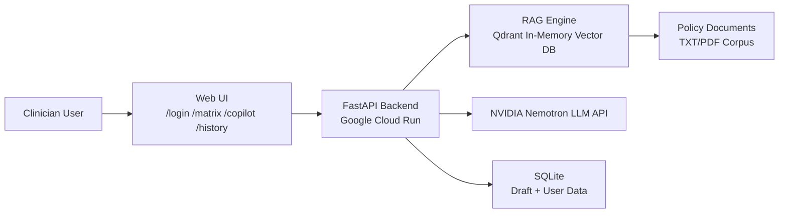

# AntonRx Hackathon Project

## Time-to-Therapy Prior Authorization Copilot

A FastAPI-based clinician workflow tool that combines:
- coverage matrix comparison across payers,
- policy-grounded PA draft generation,
- draft history persistence and review.

It is implemented as a single deployable web app: backend APIs + static frontend pages served from the same service.

## What Problem This Solves
Specialty medication prior authorization is slow and fragmented across payer policies. Teams lose time comparing criteria, finding evidence, and drafting letters under pressure.

Time-to-Therapy reduces that cycle by:
- indexing payer policy documents for retrieval,
- exposing searchable matrix views for policy comparison,
- generating draft letters with retrieved policy evidence,
- preserving draft history for follow-up and auditability.

## Current Feature Set

### 1) Coverage Matrix
- Dynamic rows built from indexed policy records (not hardcoded payloads).
- Query, payer, and category filtering.
- Cross-payer comparison snapshot endpoint.
- Oncology drug info lookup helper endpoint.
- Export of filtered rows from UI.

### 2) Copilot Drafting
- Uses patient context + payer target.
- Retrieves top policy evidence from in-memory vector index.
- Generates draft through NVIDIA Nemotron endpoint.
- Returns deterministic no-data sentinel when no policy evidence is found.
- Supports PDF/CSV export from frontend.

### 3) Draft History
- Persists generated drafts, context, and retrieved rules in SQLite.
- Lists history in reverse chronological order.
- Supports detail review of selected draft and policy evidence.

### 4) Authentication
- Auth is enabled by default.
- Default mode is local credential auth (register/login).
- Optional Auth0 mode activates when Auth0 env vars are fully configured.
- Protected routes redirect unauthenticated users to `/login`.

## Tech Stack
- Backend: FastAPI, Pydantic, httpx
- Retrieval: Qdrant client (in-memory), deterministic hashed embeddings
- LLM: NVIDIA NIM Nemotron via OpenAI-compatible client
- Storage: SQLite (`backend/history.db`)
- Frontend: HTML, Tailwind CDN, vanilla JavaScript
- Runtime packaging: Docker

## Architecture Diagrams

### High-Level Architecture


### Low-Level Architecture
```mermaid
flowchart TB
  subgraph Frontend[Frontend Layer - site/public]
    Login[login.html]
    Matrix[matrix.html]
    Copilot[copilot.html]
    History[history.html]
    AuthJS[auth.js]
  end

  subgraph Backend[API Layer - backend/main.py]
    AuthRoutes[/auth/config /auth/me /auth/login /auth/register /auth/session /auth/logout]
    PageRoutes[/ /login /matrix /copilot /history]
    MatrixRoutes[/api/matrix /api/matrix/categories /api/matrix/compare]
    DraftRoutes[/draft /api/draft/test-cases]
    HistoryRoute[/api/history]
    SearchRoute[/api/oncology-search]
    Health[/health]
  end

  subgraph Services[Service Layer]
    RAGSvc[RAGEngine\nbackend/pipeline/rag_engine.py]
    Drafter[PADrafter\nbackend/generator/drafter.py]
    AuthSvc[Session/Auth\nbackend/auth.py]
  end

  subgraph Data[Data Layer]
    PolicyFiles[backend/pipeline/documents]
    Schema[backend/schema/policy.json]
    DLQ[backend/pipeline/dlq.jsonl]
    Qdrant[(Qdrant In-Memory Index)]
    SQLite[(backend/history.db)]
  end

  Login --> AuthJS
  Matrix --> AuthJS
  Copilot --> AuthJS
  History --> AuthJS

  Login --> AuthRoutes
  Matrix --> MatrixRoutes
  Copilot --> DraftRoutes
  History --> HistoryRoute

  AuthRoutes --> AuthSvc
  MatrixRoutes --> RAGSvc
  DraftRoutes --> RAGSvc
  DraftRoutes --> Drafter
  DraftRoutes --> SQLite
  HistoryRoute --> SQLite
  SearchRoute --> RAGSvc
  Health --> RAGSvc

  RAGSvc --> PolicyFiles
  RAGSvc --> Schema
  RAGSvc --> DLQ
  RAGSvc --> Qdrant
  Drafter --> LLMExt[NVIDIA API]
```

## Repository Layout (Key Paths)
- [backend/main.py](backend/main.py) - app entrypoint, routes, auth/session wiring
- [backend/auth.py](backend/auth.py) - auth provider selection, token/session validation
- [backend/pipeline/rag_engine.py](backend/pipeline/rag_engine.py) - indexing, retrieval, matrix construction
- [backend/generator/drafter.py](backend/generator/drafter.py) - LLM draft generation and fallback behavior
- [backend/qa_smoke_test.py](backend/qa_smoke_test.py) - end-to-end smoke checks
- [site/public/matrix.html](site/public/matrix.html) - coverage matrix UI
- [site/public/copilot.html](site/public/copilot.html) - drafting UI
- [site/public/history.html](site/public/history.html) - history UI
- [site/public/login.html](site/public/login.html) - login/registration UI
- [site/public/auth.js](site/public/auth.js) - client auth bootstrap + protected API behavior
- [PROJECT_ARCHITECTURE.md](PROJECT_ARCHITECTURE.md) - detailed architecture document

## Environment Setup
Copy the template and set values:

```bash
cp .env.example .env
```

Primary variables (see [.env.example](.env.example) for full list):

```env
NVIDIA_API_KEY=
STRICT_LLM_MODE=true
ALLOWED_ORIGINS=http://localhost:8005,http://127.0.0.1:8005

AUTH_ENABLED=true
AUTH0_DOMAIN=
AUTH0_CLIENT_ID=
AUTH0_AUDIENCE=
AUTH0_CALLBACK_PATH=/auth/callback
AUTH0_LOGOUT_RETURN_PATH=/login

APP_SESSION_SECRET=
SESSION_TTL_SECONDS=28800
SESSION_COOKIE_SECURE=false
```

## Run Locally

### 1) Install dependencies

```bash
python -m pip install -r backend/aws_deployment_config/requirements.txt
```

### 2) Start the app

```bash
python -m uvicorn backend.main:app --host 0.0.0.0 --port 8005
```

### 3) Open in browser
- http://localhost:8005/login
- After auth, navigate to:
  - `/matrix`
  - `/copilot`
  - `/history`

## API Quick Reference

Auth/session:
- `GET /auth/config`
- `GET /auth/me`
- `POST /auth/register`
- `POST /auth/login`
- `POST /auth/session`
- `POST /auth/logout`

Core APIs:
- `GET /health`
- `GET /api/matrix`
- `GET /api/matrix/categories`
- `GET /api/matrix/compare`
- `GET /api/oncology-search`
- `POST /draft`
- `GET /api/history`
- `GET /api/draft/test-cases`

## QA and Verification
Run smoke tests:

```bash
python backend/qa_smoke_test.py
```

The smoke suite validates:
- auth flow and route protection,
- matrix retrieval/filter/compare/category behavior,
- known vs unknown draft behavior,
- history persistence,
- frontend-to-backend wiring.

Optional direct draft-generation check:

```bash
python test_nemotron.py
```

## Docker
Build and run:

```bash
docker build -t antorx-time-to-therapy .
docker run --rm -p 8080:8080 --env-file .env antorx-time-to-therapy
```

Container entrypoint is defined in [Dockerfile](Dockerfile).

## Production Deployment
For Google Cloud Run deployment steps, use:
- [DEPLOY_GCP_CLOUD_RUN.md](DEPLOY_GCP_CLOUD_RUN.md)

Live production URL:
- https://time-to-therapy-4todzcphia-uc.a.run.app/

## Known Constraints
- Vector index is in-memory and rebuilt on restart.
- SQLite is local-file based; on Cloud Run, local filesystem is ephemeral.
- Policy extraction is heuristic and depends on source document structure.
- This project supports policy-grounded workflow assistance and is not medical advice.
