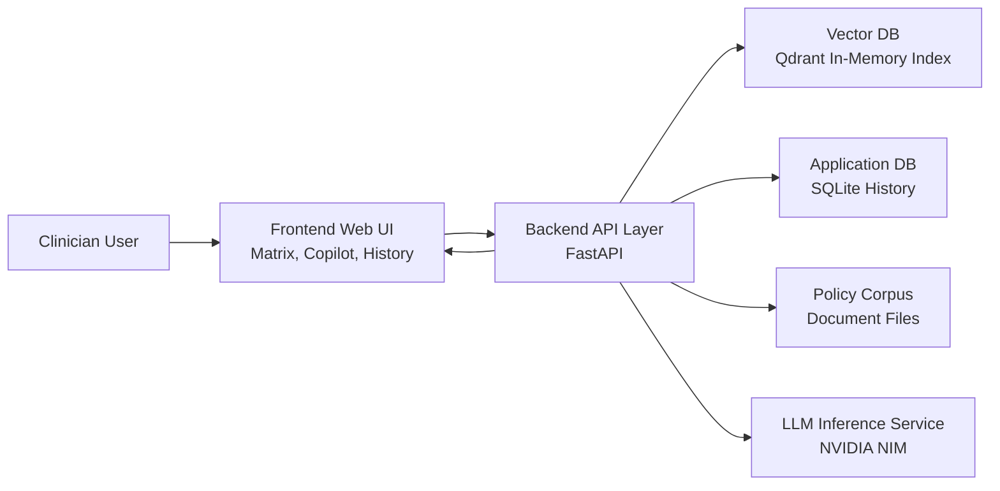
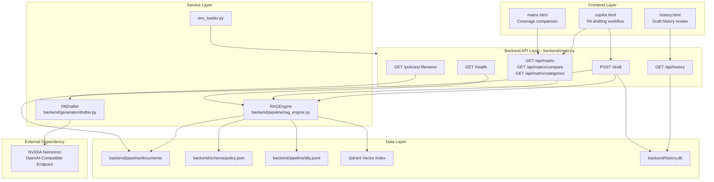

# AntonRx Hackathom Project

## Time-to-Therapy Prior Authorization Copilot

### What Major Problem This Solves
Specialty medication prior authorization (PA) is slow, manual, and policy-fragmented across payers. Teams often lose time searching long policy documents, comparing criteria payer by payer, and drafting appeal or authorization letters under tight timelines.

This project targets that bottleneck by reducing time-to-therapy for patients through:
- fast cross-payer policy comparison,
- evidence-grounded policy retrieval,
- and automated PA drafting with source attribution.

## How We Solve It
The application combines three capabilities in one workflow:

1. Coverage Matrix
- Presents side-by-side payer coverage criteria.
- Uses backend policy extraction and filtering logic, not hardcoded matrix payloads.
- Supports query and payer filtering for targeted review.

2. Copilot Drafting
- Accepts patient context and payer target.
- Retrieves relevant policy evidence from indexed policy documents using semantic retrieval.
- Generates a PA draft grounded in retrieved clauses.
- Returns explicit no-data behavior when evidence is missing: `Policy data not found in current coverage index.`

3. Draft History
- Stores generated drafts and supporting retrieved rules.
- Enables review of prior requests and evidence used.

## What We Use To Solve It
### Backend
- FastAPI for API and page serving.
- Qdrant (in-memory) as vector database for policy chunk retrieval.
- Deterministic embedding pipeline for semantic policy search.
- SQLite for draft persistence and history.
- OpenAI-compatible NVIDIA NIM endpoint for Nemotron generation.

### Frontend
- HTML/CSS/JavaScript pages under `site/public`.
- Tailwind CSS for styling.
- Direct integration with backend APIs for matrix, draft, and history.

### Core Services
- `RAGEngine` in `backend/pipeline/rag_engine.py`
- `PADrafter` in `backend/generator/drafter.py`
- API routes in `backend/main.py`

## Architecture Diagrams
### High-Level Architecture


### Low-Level Architecture


## Data: What It Is and Where It Is Accessed
### Source Policy Data
Policy documents are loaded from:
- `backend/pipeline/documents/`

Current examples include payer policy text files (Aetna, UHC, Cigna).

### Extracted and Indexed Data
- Policy chunks are parsed and embedded into Qdrant for retrieval.
- Extracted policy records are validated against schema:
  - `backend/schema/policy.json`
- Validation failures are written to a dead-letter queue file:
  - `backend/pipeline/dlq.jsonl`

### Persisted Application Data
- Draft history is persisted to SQLite:
  - `backend/history.db`

## Request/Response Flow
1. User opens `matrix`, `copilot`, or `history` page.
2. Frontend calls backend APIs (`/api/matrix`, `/draft`, `/api/history`).
3. Backend retrieves policy evidence from vector index and/or database.
4. Backend returns structured data with source metadata.
5. UI renders response and citations.

## API Endpoints
- `GET /health`
  - Health and indexing status.
- `GET /api/matrix?query=<text>&payer=<name>`
  - Returns coverage rows derived from indexed policy records.
- `POST /draft`
  - Generates PA draft from patient context and retrieved policy evidence.
- `GET /api/history`
  - Returns stored draft history.
- `GET /policies/<filename>`
  - Serves source policy files used in citations.

## Environment Configuration
Create a root `.env` file (already supported by project env loader):

```env
NVIDIA_API_KEY=your_key_here
STRICT_LLM_MODE=true
ALLOWED_ORIGINS=https://frontend-app.example
```

Notes:
- In strict mode, missing/failed LLM calls raise runtime errors.
- `.env` is excluded from git; use `.env.example` as template.

## Local Run
1. Install dependencies:
```bash
python -m pip install -r backend/aws_deployment_config/requirements.txt
```

2. Start the backend:
```bash
python -m uvicorn backend.main:app --host 0.0.0.0 --port 8005
```

3. Access frontend routes served by backend:
- Frontend route: `/matrix`
- Frontend route: `/copilot`
- Frontend route: `/history`

## QA and Verification
Run automated smoke tests:

```bash
python backend/qa_smoke_test.py
```

The suite verifies:
- page routes,
- API health,
- matrix filtering,
- known/unknown draft behavior,
- history persistence,
- and frontend-to-backend wiring assertions.

## Repository Structure (Key Paths)
- `backend/main.py` - API + Frontend route entrypoint
- `backend/pipeline/rag_engine.py` - policy parsing, indexing, retrieval
- `backend/generator/drafter.py` - draft generation
- `backend/qa_smoke_test.py` - regression checks
- `site/public/matrix.html` - matrix UI
- `site/public/copilot.html` - drafting UI
- `site/public/history.html` - history UI

## Scope and Current Constraints
- Vector index is in-memory at runtime.
- Policy corpus is based on local document files.
- Real-time payer API integration is out of scope for this version.
- This is designed for deterministic policy-grounded retrieval, not general medical advice.
